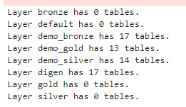
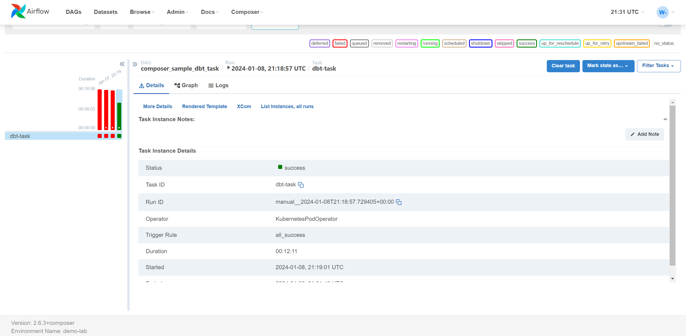

IMPORTANT ❗ ❗ ❗ Please remember to destroy all the resources after each work session. You can recreate infrastructure by creating new PR and merging it to master.


0. The goal of this phase is to create infrastructure, perform benchmarking/scalability tests of sample three-tier lakehouse solution and analyze the results using:
* [TPC-DI benchmark](https://www.tpc.org/tpcdi/)
* [dbt - data transformation tool](https://www.getdbt.com/)
* [GCP Composer - managed Apache Airflow](https://cloud.google.com/composer?hl=pl)
* [GCP Dataproc - managed Apache Spark](https://spark.apache.org/)
* [GCP Vertex AI Workbench - managed JupyterLab](https://cloud.google.com/vertex-ai-notebooks?hl=pl)

Worth to read:
* https://docs.getdbt.com/docs/introduction
* https://airflow.apache.org/docs/apache-airflow/stable/index.html
* https://spark.apache.org/docs/latest/api/python/index.html
* https://medium.com/snowflake/loading-the-tpc-di-benchmark-dataset-into-snowflake-96011e2c26cf
* https://www.databricks.com/blog/2023/04/14/how-we-performed-etl-one-billion-records-under-1-delta-live-tables.html

2. Authors:

   ***Enter your group nr***
   * Wojciech Gierulski
   * Jakub Płudowski

   ***[Link to forked repo](https://github.com/WojciechGierulski/tbd-2023z-phase1)***

3. Replace your `main.tf` (in the root module) from the phase 1 with [main.tf](https://github.com/bdg-tbd/tbd-workshop-1/blob/v1.0.36/main.tf)
and change each module `source` reference from the repo relative path to a github repo tag `v1.0.36` , e.g.:
```hcl
module "dbt_docker_image" {
  depends_on = [module.composer]
  source             = "github.com/bdg-tbd/tbd-workshop-1.git?ref=v1.0.36/modules/dbt_docker_image"
  registry_hostname  = module.gcr.registry_hostname
  registry_repo_name = coalesce(var.project_name)
  project_name       = var.project_name
  spark_version      = local.spark_version
}
```


4. Provision your infrastructure.

    a) setup Vertex AI Workbench `pyspark` kernel as described in point [8](https://github.com/bdg-tbd/tbd-workshop-1/tree/v1.0.32#project-setup) 

    b) upload [tpc-di-setup.ipynb](https://github.com/bdg-tbd/tbd-workshop-1/blob/v1.0.36/notebooks/tpc-di-setup.ipynb) to 
the running instance of your Vertex AI Workbench

5. In `tpc-di-setup.ipynb` modify cell under section ***Clone tbd-tpc-di repo***:

   a)first, fork https://github.com/mwiewior/tbd-tpc-di.git to your github organization.

   b)create new branch (e.g. 'notebook') in your fork of tbd-tpc-di and modify profiles.yaml by commenting following lines:
   ```  
        #"spark.driver.port": "30000"
        #"spark.blockManager.port": "30001"
        #"spark.driver.host": "10.11.0.5"  #FIXME: Result of the command (kubectl get nodes -o json |  jq -r '.items[0].status.addresses[0].address')
        #"spark.driver.bindAddress": "0.0.0.0"
   ```
   This lines are required to run dbt on airflow but have to be commented while running dbt in notebook.

   c)update git clone command to point to ***your fork***.

 


6. Access Vertex AI Workbench and run cell by cell notebook `tpc-di-setup.ipynb`.

    a) in the first cell of the notebook replace: `%env DATA_BUCKET=tbd-2023z-9910-data` with your data bucket.


   b) in the cell:
         ```%%bash
         mkdir -p git && cd git
         git clone https://github.com/mwiewior/tbd-tpc-di.git
         cd tbd-tpc-di
         git pull
         ```
      replace repo with your fork. Next checkout to 'notebook' branch.
   
    c) after running first cells your fork of `tbd-tpc-di` repository will be cloned into Vertex AI  enviroment (see git folder).

    d) take a look on `git/tbd-tpc-di/profiles.yaml`. This file includes Spark parameters that can be changed if you need to increase the number of executors and
  ```
   server_side_parameters:
       "spark.driver.memory": "2g"
       "spark.executor.memory": "4g"
       "spark.executor.instances": "2"
       "spark.hadoop.hive.metastore.warehouse.dir": "hdfs:///user/hive/warehouse/"
  ```


7. Explore files created by generator and describe them, including format, content, total size.

      Pod ścieżką tbd-2023z-303748-data/tpc-di w naszym Google Cloud Storage utworzyło się 217 plików. 203 z nich to pliki binarne FINWIRE osiągające objętość od 60 KB do 900KB. Oprócz nich są tam 2 pliki CSV (prospect.csv oraz hr.csv), 1 plik XML (customermgmtt.xml) oraz 11 plików TXT. Te pliki osiągają już rozmiary około 300 MB. Pliki te zawieraja dane, które będą zaczytywane w następnych krokach.

8. Analyze tpcdi.py. What happened in the loading stage?

   Program składa sie z dwóch głównych funkcji: get_session oraz process_files, która zawiera cztery podfunkcje. Funkcja get_session inicjalizuje sesje pysparkową i dla wszystkich baz danych [`digen`, `bronze`, `silver`, `gold`] tworzy baze danych na Hive. Funkcja ustawia baze digen na aktualnie używaną.
   Funkcja process_files posiada cztery funkcje: get_stage_path, która zwraca specyficzną ścieżkę do Google Cloud Storage, save_df, która zapisuje dane typu DataFrame w formacie parquet, upload_files, która na podstawie rozszerzenia lub typu pliku ustawia delimiter i wgrywa dane z pliku na bloba oraz funkcję load_csv, która ma najdłuższą funkcjonalność i odpowiada za czytanie plików csv do zmiennych typu DataFrame. W zależności od metadanych pliku funkcja ta generuje Schema Dataframe'u za pomocą StructFields i typów zaimportowanych ze sparka. W trakcie ładowania program najpierw ustala wszystkie zależności za pomocą Ivy, a potem zaczytuje tabele. W naszym przypadku wystąpiło kilka ostrzeżeń, ale mimo to program załadował dane w całości bez błędów.

9. Using SparkSQL answer: how many table were created in each layer?

      ***SparkSQL command and output***

   ```python
   database_namespace = spark.sql("show databases").collect()
   databases = [x.namespace for x in database_namespace]
   results = []
   for layer in databases:
      spark.sql(f"use {layer}")
      results.append((layer, spark.sql("show tables").count()))
   for name, number in results:
      print(f"Layer {name} has {number} tables.")
   
   
   ```

   

10. Add some 3 more [dbt tests](https://docs.getdbt.com/docs/build/tests) and explain what you are testing. ***Add new tests to your repository.***

   ***Code and description of your tests***
   * **Test 1**
      ```sql
      select 
         *
      from {{ ref('dim_broker') }} 
      where first_name is null or last_name is null
      ```
      Test na to czy są w tabeli są obecne dane pozwalające w łatwy sposób zidentyfikować osobę (imię, nazwisko). Identyfikacja po sztucznym ID nie zawsze jest oczywista.
   * **Test 2**
      ```sql
      select 
         *
      from {{ ref('dim_date') }} 
      where DAY_OF_WEEK_DESC not in ('Monday', 'Tuesday', 'Wednesday', 'Thursday', 'Friday', 'Saturday', 'Sunday')
      ```
      Test na to czy koluman day_of_week zawiera poprawne wartości.
   * **Test 3**
      ```sql
      select 
         *
      from {{ ref('dim_security') }} 
      where status not in ('Active', 'Inactive')
      ```
      Test na to czy kolumna status zawiera poprawne wartości.

   


11. In main.tf update
   ```
   dbt_git_repo            = "https://github.com/mwiewior/tbd-tpc-di.git"
   dbt_git_repo_branch     = "main"
   ```
   so dbt_git_repo points to your fork of tbd-tpc-di. 

12. Redeploy infrastructure and check if the DAG finished with no errors:

***The screenshot of Apache Aiflow UI***
