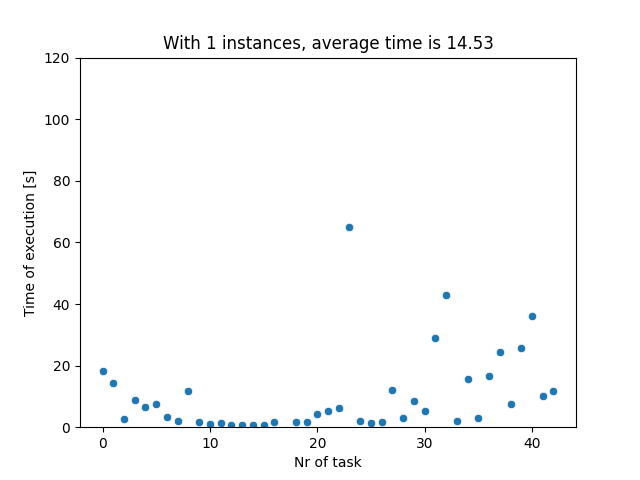
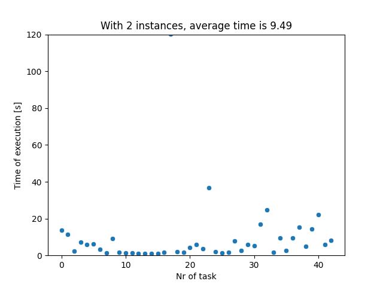
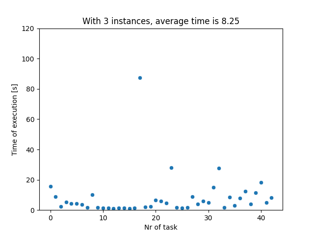
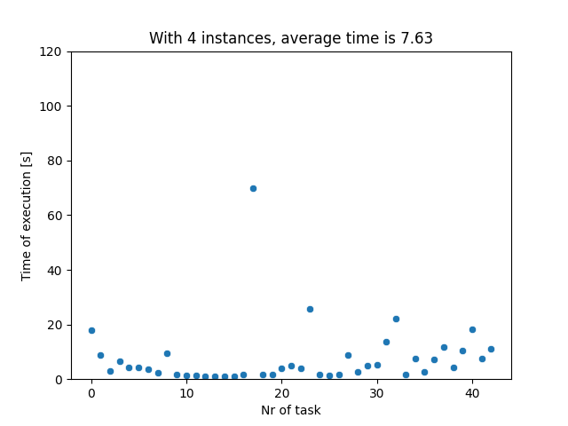
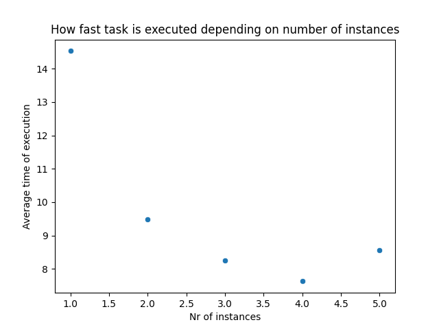

0. The goal of phase 2b is to perform benchmarking/scalability tests of sample three-tier lakehouse solution.

1. In main.tf, change machine_type at:

```
module "dataproc" {
  depends_on   = [module.vpc]
  source       = "github.com/bdg-tbd/tbd-workshop-1.git?ref=v1.0.36/modules/dataproc"
  project_name = var.project_name
  region       = var.region
  subnet       = module.vpc.subnets[local.notebook_subnet_id].id
  machine_type = "e2-standard-2"
}
```

and subsititute "e2-standard-2" with "e2-standard-4".

2. If needed request to increase cpu quotas (e.g. to 30 CPUs): 
https://console.cloud.google.com/apis/api/compute.googleapis.com/quotas?project=tbd-2023z-9918

3. Using tbd-tpc-di notebook perform dbt run with different number of executors, i.e., 1, 2, and 5, by changing:
```
 "spark.executor.instances": "2"
```

in profiles.yml.

4. In the notebook, collect console output from dbt run, then parse it and retrieve total execution time and execution times of processing each model. Save the results from each number of executors. 

5. Analyze the performance and scalability of execution times of each model. Visualize and discucss the final results.

Z każdego pliku z logami zgraliśmy czasy wykonania każdego poszczególnego zadania. Niektóre z nich wykonywały się krócej a niektóre dłużej. Dla każdego zadania narysowano wyresy opisujące czas wykonania każdego zadania. Oprócz tego wykreśliliśmy wykres opisujący średni czas działania w zależności od liczby instancji. 








Jak widać na wykresach kształt zależności przypomina coś w stylu funkcji kwadratowej z minimum dla wartości nr_of_instances równej 4. Oznacza to, że gdy instancji było 5 to kod wykonywał się dłużej. Powodów takiego zachowania może być kilka ale przede wszsytkim najprawdopodobniej mamy za mało danych dla 5 klastrów i taki podział przestaje być optymalny. Kolejne instancje executora mogą zacząć konkurować o zasoby, może dojść do dużej fragmentacji danych. Jeśli isntancji jest za dużo to mogą one też po prostu działać nieefektywnie. Ważne jest aby zadbać o równowagę pomiędzy ilością zasobów a obciążeniem przetwarzania executorów. Dodatkowo warto zwrócić uwagę na ostrzeżenia dotyczące Hive. Opisują one, że niektóre parametry konfiguracji mogą być domyślne co może nie być optymalne. Niepokojąco też wyglądają ostrzeżenia o dodawaniu wielokrotnie tych samych plików jar do cache'a.


   